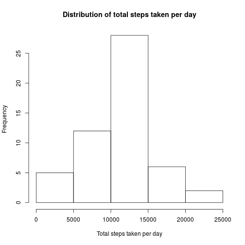
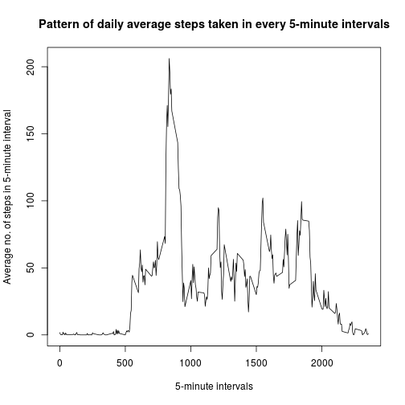
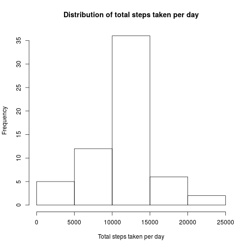
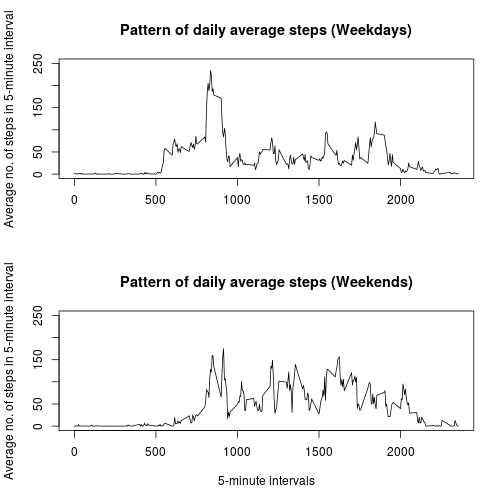

Reproducible Research: Peer Assessment 1
========================================
----------------------------------

## Loading and preprocessing the data
* Load the data
* Process/transform the data (if necessary) into a format suitable for your analysis

```r
data <- read.table(unz("activity.zip", "activity.csv"), 
        colClasses=c('integer','character','integer'), 
        header=T, quote="\"", sep=",")
data[,'date'] <- as.Date(data$date,"%Y-%m-%d")
```

## What is mean total number of steps taken per day?
* Calculate the total number of steps taken per day

```r
library(dplyr)
dt          <- tbl_df( data[complete.cases(data), ] )
by_day      <- group_by(dt, date)
total_steps <- summarise(by_day, sums=sum(steps, na.rm=TRUE))
```

* Make a histogram of the total number of steps taken each day

```r
hist(total_steps$sums, main='Distribution of total steps taken per day',
     xlab='Total steps taken per day')
```

 

* Calculate and report the mean and median of the total number of steps taken per day

```r
meanByDay   <- mean(total_steps$sums)
medianByDay <- median(total_steps$sums)
```
  - Mean of total steps taken per day  : 1.0766189 &times; 10<sup>4</sup>
  - Median of total steps taken per day:  10765


## What is the average daily activity pattern?
* Make a time series plotof the 5-minute interval (x-axis) and the average number of steps taken, averaged across all days (y-axis)

```r
by_interval <-group_by(dt, interval)
total_steps <- summarise(by_interval, means=mean(steps))
with(total_steps, 
     plot(interval, means, type='l',
          main='Pattern of daily average steps taken in every 5-minute intervals',
          xlab ='5-minute intervals',
          ylab = 'Average no. of steps in 5-minute interval'))
```

 

* Which 5-minute interval, on average across all the days in the dataset, contains the maximum number of steps?

```r
max_steps <- total_steps[which.max(total_steps$means),]
print(max_steps)
```

```
## Source: local data frame [1 x 2]
## 
##   interval    means
## 1      835 206.1698
```
- The maximum number of steps happened at 835-th interval, with the average 206.1698113 number of steps.


## Imputing missing values

* Calculate and report the total number of missing values in the dataset 

```r
total_na <- sum(is.na(data))
print(total_na)
```

```
## [1] 2304
```
* There are total of 2304 number of rows with missing values.

* Devise a strategy for filling in all of the missing values in the dataset. Create a new dataset that is equal to the original dataset but with the missing data filled in. 

(My strategy here is to fill in the missing values with the mean of 5-minute interval.)

```r
fn            <- function(x){total_steps[total_steps$interval == x,]$means}
filled_dt     <- tbl_df(data)
nas           <- filled_dt[is.na(filled_dt),]
p             <- sapply(nas$interval, fn)
filled_dt[is.na(filled_dt)] <- p
```

* Make a histogram of the total number of steps taken each day. Calculate and report the mean and median total number of steps taken per day. Do these values differ from the estimates from the first part of the assignment? What is the impact of imputing missing data on the estimates of the total daily number of steps?

```r
by_day      <- group_by(filled_dt, date)
total_steps <- summarise(by_day, sums=sum(steps))
hist(total_steps$sums, main='Distribution of total steps taken per day',
     xlab='Total steps taken per day')
```

 

```r
meanByDay   <- mean(total_steps$sums)
medianByDay <- median(total_steps$sums)
```
  - Mean of total steps taken per day  : 1.0766189 &times; 10<sup>4</sup>
  - Median of total steps taken per day:  1.0766189 &times; 10<sup>4</sup>


## Are there differences in activity patterns between weekdays and weekends?

Create a new factor variable in the dataset with two levels – “weekday” and “weekend” indicating whether a given date is a weekday or weekend day.

```r
library(timeDate)
dt$isWeekend <- as.factor(sapply(dt$date, isWeekend))
```

Make a panel plot containing a time series plot (i.e. type = "l") of the 5-minute interval (x-axis) and the average number of steps taken, averaged across all weekday days or weekend days (y-axis).

```r
dt_Weekday <-filter(dt, isWeekend==FALSE) %>% 
        group_by(interval) %>%
        summarise(means=mean(steps))
dt_Weekend <-filter(dt, isWeekend==TRUE) %>% 
        group_by(interval) %>%
        summarise(means=mean(steps))
par(mfrow=c(2,1))
with(dt_Weekday, 
     plot(interval, means, type='l',
          ylim = c(0,250),
          main='Pattern of daily average steps (Weekdays)',
          xlab ='',
          ylab = 'Average no. of steps in 5-minute interval')
     )
with(dt_Weekend, 
     plot(interval, means, type='l',
          ylim = c(0,250),
          main='Pattern of daily average steps (Weekends)',
          xlab ='5-minute intervals',
          ylab = 'Average no. of steps in 5-minute interval')
     )
```

 

